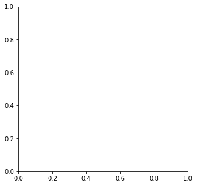
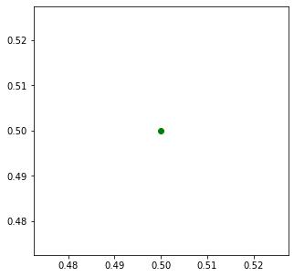
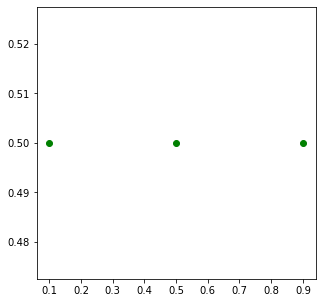

# Matplotlib Basics

Before we start using `matplotlib` inside a Jupyter notebook, it is useful to set the matplotlib backend to `inline`. This setting makes the matplotlib graphs included in your notebook, next to the code. [Learn more](https://ipython.readthedocs.io/en/stable/interactive/plotting.html) about different plotting backends.

We use the [magic function](https://ipython.readthedocs.io/en/stable/interactive/tutorial.html#magics-explained) `%matplotlib` to achieve this.


```python
import os

%matplotlib inline
import matplotlib.pyplot as plt
```

It is important to understand the 2 matplotlib objects

* Figure: This is the main container of the plot. A figure can contain multiple plots inside it
* Axes:  Axes refers to an individual plot or graph. A figure contains 1 or more axes.

We create a figure and a single subplot. Specifying 1 row and 1 column for the `subplots()` function create a figure and an axes within it. Even if we have a single plot in the figure, it is useful to use tthis logic of intialization so it is consistent across different scripts.


```python
fig, ax = plt.subplots(1, 1)
fig.set_size_inches(5,5)
plt.show()
```


    

    


First, let's learn how to plot a single point using matplotlib. Let's say we want to display a point at the coordinate (0.5, 0.5). 


```python
point = (0.5, 0.5)
```

We display the point using the `plot()` function. The `plot()` function expects at least 2 arguments, first one being one or more x coordinates and the second one being one or more y coordinates. Remember that once a plot is displayed using `plt.show()`, it displays the plot and empties the figure. So you'll have to create it again.

Reference: [matplotlib.pyplot.plot](https://matplotlib.org/stable/api/_as_gen/matplotlib.pyplot.plot.html)


```python
fig, ax = plt.subplots(1, 1)
fig.set_size_inches(5,5)
ax.plot(point[0], point[1], color='green', marker='o')
plt.show()
```


    

    


**Note: Understanding `*args` and `**kwargs`**

Python functions accept 2 types of arguments.
- *Non Keyword Arguments*: These are referred as `*args`. When the number of arguments that a function takes is not fixed, it is specified as `*args`. In the function `plot()` above, you can specify 1 argument, 2 arguments or even 6 arguments and the function will respond accordingly.
- *Keyword Arguments*: These are referred as `**kwargs`. These are specified as `key=value` pairs and usually used to specify optional parameters. These should always be specified after the non-keyword arguments. The `color='green'` in the `plot()` function is a keyboard argument.

One problematic area for plotting geospatial data using matplotlib is that geospatial data is typically represented as a list of x and y coordinates. Let's say we want to plot the following 3 points defined as a list of (x,y) tuples.


```python
points = [(0.1, 0.5), (0.5, 0.5), (0.9, 0.5)]
```

But to plot it, `matplotlib` require 2 separate lists or x and y coordinates. Here we can use the `zip()` function to create list of x and y coordinates.


```python
x, y = zip(*points)
print(x)
print(y)
```

    (0.1, 0.5, 0.9)
    (0.5, 0.5, 0.5)


Now these can be plotted using the `plot()` method. We specify the 3rd argument to the function is the `fmt` string - specifying the **format** of the symbols. It can be used to specify a string describing the symbol as `[marker][line][color]` sequence. In the following example, we specify it as `og` - meaning *[round markers][no line][green color]*


```python
fig, ax = plt.subplots(1, 1)
fig.set_size_inches(5,5)
ax.plot(x, y, 'og')
plt.show()
```


    

    


You can save the figure using the `savefig()` method. Remember to save the figure *before* calling `plt.show()` otherwise the figure would be empty.


```python
fig, ax = plt.subplots(1, 1)
fig.set_size_inches(5,5)
ax.plot(x, y, 'og')

output_folder = 'output'
output_path = os.path.join(output_folder, 'simple.png')
plt.savefig(output_path)

plt.show()
```


    

    


Matplotlib provides many specialized functions for different types of plots. `scatter()` for Scatter Charts, `bar()` for Bar Charts and so on. You can use them directly, but in practice they are used via higher-level libraries like `pandas`. In the next section, we will see how to create such charts.

## Exercise

Change the plot below to display the markers in a triangle shape.

*Run all previous cells before attempting the exercise.*


```python
fig, ax = plt.subplots(1, 1)
fig.set_size_inches(5,5)
ax.plot(x, y, 'og')
plt.show()
```


    

    


```python

```
