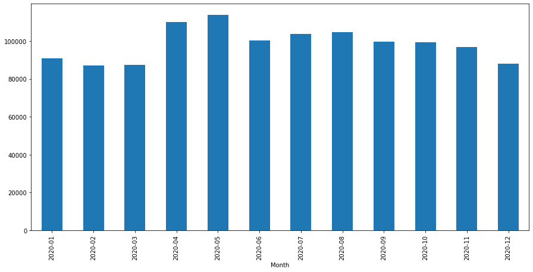

# Creating Charts

Pandas allows you to read structured datasets and visualize them using the `plot()` method. By default, Pandas uses `matplotlib` to create the plots.

In this notebook, we will take work with open dataset of crime in London.


```python
import pandas as pd
import os
import glob

%matplotlib inline
import matplotlib.pyplot as plt
```

We have 12 different CSV files containing crime data for each month of 2020. We can use the `glob` module to find all files matching a pattern.


```python
data_pkg_path = 'data'
folder = 'crime'
file_pattern = '2020-*.csv'
file_path_pattern = os.path.join(data_pkg_path, folder, file_pattern)

file_list = []
for file in glob.glob(file_path_pattern):
    file_list.append(file)
file_list
```


    ['data/crime/2020-05-metropolitan-street.csv',
     'data/crime/2020-12-metropolitan-street.csv',
     'data/crime/2020-01-metropolitan-street.csv',
     'data/crime/2020-02-metropolitan-street.csv',
     'data/crime/2020-11-metropolitan-street.csv',
     'data/crime/2020-06-metropolitan-street.csv',
     'data/crime/2020-09-metropolitan-street.csv',
     'data/crime/2020-04-metropolitan-street.csv',
     'data/crime/2020-08-metropolitan-street.csv',
     'data/crime/2020-07-metropolitan-street.csv',
     'data/crime/2020-10-metropolitan-street.csv',
     'data/crime/2020-03-metropolitan-street.csv']


It will be helpful to merge all these files into a single dataframe. We can use `pd.concat()` to merge a list of dataframes.


```python
dataframe_list = []

for file in file_list:
    df = pd.read_csv(file)
    dataframe_list.append(df)

merged_df = pd.concat(dataframe_list)
```

Let's create a pie-chart showing the distribution of different types of crime. Pandas `groupby()` function allows us to calculate group statistics.


```python
type_counts = merged_df.groupby('Crime type').size()
type_counts
```


    Crime type
    Anti-social behaviour           415105
    Bicycle theft                    23517
    Burglary                         61044
    Criminal damage and arson        50923
    Drugs                            51629
    Other crime                      10066
    Other theft                      81924
    Possession of weapons             5763
    Public order                     53458
    Robbery                          27269
    Shoplifting                      34588
    Theft from the person            31084
    Vehicle crime                   108344
    Violence and sexual offences    227208
    dtype: int64


We now uses the `plot()` method to create the chart. This method is a wrapper around `matplotlib` and can accept supported arguments from it. 

Reference: [pandas.DataFrame.plot](https://pandas.pydata.org/docs/reference/api/pandas.DataFrame.plot.html)


```python
fig, ax = plt.subplots(1, 1)
fig.set_size_inches(15,7)
type_counts.plot(kind='pie', ax=ax, wedgeprops={'linewidth': 1.0, 'edgecolor': 'white'}, label='')
plt.tight_layout()
plt.title('Crime Types', fontsize = 18)

plt.show()
```


    

    


We can also chart the trend of crime over the year. For this, let's group the data by month.


```python
monthly_counts = merged_df.groupby('Month').size()
monthly_counts
```


    Month
    2020-01     90979
    2020-02     86984
    2020-03     87409
    2020-04    109951
    2020-05    114008
    2020-06    100198
    2020-07    103657
    2020-08    104782
    2020-09     99633
    2020-10     99471
    2020-11     96914
    2020-12     87936
    dtype: int64


```python
fig, ax = plt.subplots(1, 1)
fig.set_size_inches(15,7)
monthly_counts.plot(kind='bar', ax=ax)
plt.show()
```


    

    


We can make the chart more informating by stacking the chart with information about crime type. 


```python
counts_by_type = merged_df.groupby(['Month', 'Crime type']).size()
counts_by_type
```


    Month    Crime type                  
    2020-01  Anti-social behaviour           17548
             Bicycle theft                    1172
             Burglary                         6889
             Criminal damage and arson        4374
             Drugs                            4282
                                             ...  
    2020-12  Robbery                          2021
             Shoplifting                      2690
             Theft from the person            3075
             Vehicle crime                    7758
             Violence and sexual offences    17836
    Length: 168, dtype: int64


The result is not in a suitable format for plotting. We call `unstack()` to create a dataframe. 


```python
counts_df = counts_by_type.unstack()
counts_df
```


<div>
<style scoped>
    .dataframe tbody tr th:only-of-type {
        vertical-align: middle;
    }

    .dataframe tbody tr th {
        vertical-align: top;
    }

    .dataframe thead th {
        text-align: right;
    }
</style>
<table border="1" class="dataframe">
  <thead>
    <tr style="text-align: right;">
      <th>Crime type</th>
      <th>Anti-social behaviour</th>
      <th>Bicycle theft</th>
      <th>Burglary</th>
      <th>Criminal damage and arson</th>
      <th>Drugs</th>
      <th>Other crime</th>
      <th>Other theft</th>
      <th>Possession of weapons</th>
      <th>Public order</th>
      <th>Robbery</th>
      <th>Shoplifting</th>
      <th>Theft from the person</th>
      <th>Vehicle crime</th>
      <th>Violence and sexual offences</th>
    </tr>
    <tr>
      <th>Month</th>
      <th></th>
      <th></th>
      <th></th>
      <th></th>
      <th></th>
      <th></th>
      <th></th>
      <th></th>
      <th></th>
      <th></th>
      <th></th>
      <th></th>
      <th></th>
      <th></th>
    </tr>
  </thead>
  <tbody>
    <tr>
      <th>2020-01</th>
      <td>17548</td>
      <td>1172</td>
      <td>6889</td>
      <td>4374</td>
      <td>4282</td>
      <td>832</td>
      <td>9497</td>
      <td>562</td>
      <td>4025</td>
      <td>3263</td>
      <td>3853</td>
      <td>4256</td>
      <td>11975</td>
      <td>18451</td>
    </tr>
    <tr>
      <th>2020-02</th>
      <td>16975</td>
      <td>1044</td>
      <td>6216</td>
      <td>4220</td>
      <td>3818</td>
      <td>757</td>
      <td>9729</td>
      <td>452</td>
      <td>3842</td>
      <td>3152</td>
      <td>3845</td>
      <td>4570</td>
      <td>10405</td>
      <td>17959</td>
    </tr>
    <tr>
      <th>2020-03</th>
      <td>23014</td>
      <td>1078</td>
      <td>5362</td>
      <td>4392</td>
      <td>3657</td>
      <td>813</td>
      <td>7531</td>
      <td>483</td>
      <td>3966</td>
      <td>2711</td>
      <td>2996</td>
      <td>3414</td>
      <td>9621</td>
      <td>18371</td>
    </tr>
    <tr>
      <th>2020-04</th>
      <td>62763</td>
      <td>1060</td>
      <td>3661</td>
      <td>3496</td>
      <td>4978</td>
      <td>751</td>
      <td>3884</td>
      <td>460</td>
      <td>3464</td>
      <td>1101</td>
      <td>1691</td>
      <td>677</td>
      <td>6327</td>
      <td>15638</td>
    </tr>
    <tr>
      <th>2020-05</th>
      <td>58502</td>
      <td>1768</td>
      <td>3886</td>
      <td>3906</td>
      <td>6427</td>
      <td>823</td>
      <td>4443</td>
      <td>533</td>
      <td>4250</td>
      <td>1293</td>
      <td>1956</td>
      <td>795</td>
      <td>7277</td>
      <td>18149</td>
    </tr>
    <tr>
      <th>2020-06</th>
      <td>39584</td>
      <td>2548</td>
      <td>4320</td>
      <td>4353</td>
      <td>4665</td>
      <td>882</td>
      <td>5387</td>
      <td>463</td>
      <td>4966</td>
      <td>1705</td>
      <td>2400</td>
      <td>1194</td>
      <td>8102</td>
      <td>19629</td>
    </tr>
    <tr>
      <th>2020-07</th>
      <td>35588</td>
      <td>2833</td>
      <td>4928</td>
      <td>4692</td>
      <td>4569</td>
      <td>892</td>
      <td>6977</td>
      <td>453</td>
      <td>5584</td>
      <td>2168</td>
      <td>3099</td>
      <td>2072</td>
      <td>8811</td>
      <td>20991</td>
    </tr>
    <tr>
      <th>2020-08</th>
      <td>35842</td>
      <td>3019</td>
      <td>4995</td>
      <td>4710</td>
      <td>3534</td>
      <td>780</td>
      <td>7647</td>
      <td>451</td>
      <td>5490</td>
      <td>2530</td>
      <td>3006</td>
      <td>2542</td>
      <td>8919</td>
      <td>21317</td>
    </tr>
    <tr>
      <th>2020-09</th>
      <td>30863</td>
      <td>3078</td>
      <td>5195</td>
      <td>4274</td>
      <td>3541</td>
      <td>964</td>
      <td>7516</td>
      <td>503</td>
      <td>5167</td>
      <td>2599</td>
      <td>3060</td>
      <td>2696</td>
      <td>9829</td>
      <td>20348</td>
    </tr>
    <tr>
      <th>2020-10</th>
      <td>31186</td>
      <td>2619</td>
      <td>5618</td>
      <td>4214</td>
      <td>4124</td>
      <td>812</td>
      <td>7248</td>
      <td>500</td>
      <td>4577</td>
      <td>2440</td>
      <td>3222</td>
      <td>3225</td>
      <td>10148</td>
      <td>19538</td>
    </tr>
    <tr>
      <th>2020-11</th>
      <td>33863</td>
      <td>1985</td>
      <td>5209</td>
      <td>4205</td>
      <td>4410</td>
      <td>981</td>
      <td>5734</td>
      <td>511</td>
      <td>4239</td>
      <td>2286</td>
      <td>2770</td>
      <td>2568</td>
      <td>9172</td>
      <td>18981</td>
    </tr>
    <tr>
      <th>2020-12</th>
      <td>29377</td>
      <td>1313</td>
      <td>4765</td>
      <td>4087</td>
      <td>3624</td>
      <td>779</td>
      <td>6331</td>
      <td>392</td>
      <td>3888</td>
      <td>2021</td>
      <td>2690</td>
      <td>3075</td>
      <td>7758</td>
      <td>17836</td>
    </tr>
  </tbody>
</table>
</div>


Now we can create the stacked bar chart. Instead of the default legend, we create a horizontal legend with a frame using the `legend()` function.


```python
fig, ax = plt.subplots(1, 1)
fig.set_size_inches(20,10)
counts_df.plot(kind='bar', stacked=True, ax=ax, colormap='tab20')
plt.legend(loc='upper center', ncol=5, frameon=True, bbox_to_anchor=(0.5, 1.1), fancybox=True, shadow=True)
ax.spines['right'].set_visible(False)
ax.spines['top'].set_visible(False)
plt.xlabel('Year', size = 15)
plt.ylabel('Number of Incidents', size = 15)
plt.title('Crime in London (2020)', size = 18)
output_folder = 'output'
output_path = os.path.join(output_folder, 'stacked_chart.jpg')
plt.savefig(output_path)
plt.show()
```


    

    


## Exercise

Plot the trend of Bicycle thefts as a line chart.

Hint: Select the column 'Bicycle theft' from the `counts_df` dataframe and use the `plot()` function on the result.
