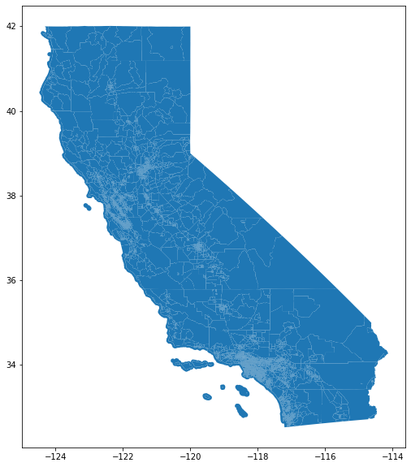
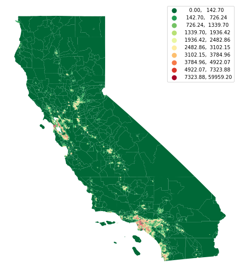
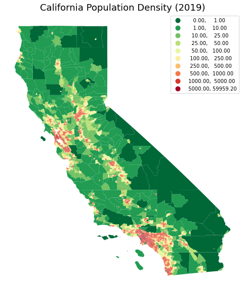

# Creating Maps


```python
import geopandas as gpd
import os
import pandas as pd

%matplotlib inline
import matplotlib.pyplot as plt
```


```python
data_pkg_path = 'data'
folder = 'census'
filename = 'tl_2019_06_tract.shp'
file_path = os.path.join(data_pkg_path, folder, filename)
tracts = gpd.read_file(file_path)
```


```python
fig, ax = plt.subplots(1, 1)
fig.set_size_inches(10,10)
tracts.plot(ax=ax)
plt.show()
```


    

    


```python
data_pkg_path = 'data'
folder = 'census'
filename = 'ACSST5Y2019.S0101_data.csv'
file_path = os.path.join(data_pkg_path, folder, filename)
table = pd.read_csv(file_path, skiprows=[1])
```


```python
filtered = table[['GEO_ID','NAME', 'S0101_C01_001E']]
filtered = filtered.rename(columns = {'S0101_C01_001E': 'Population', 'GEO_ID': 'GEOID'})

filtered['GEOID'] = filtered.GEOID.str[-11:]
```


```python
gdf = tracts.merge(filtered, on='GEOID')
```

Land Area and Persons Per Square Mile https://www.census.gov/quickfacts/fact/note/US/LND110210


```python
gdf['density'] = 1e6*gdf['Population']/gdf['ALAND']
```


```python
fig, ax = plt.subplots(1, 1)
fig.set_size_inches(10,10)
gdf.plot(ax=ax, column='density', cmap='RdYlGn_r', scheme='quantiles', k=10, legend=True)
ax.set_axis_off()
plt.show()

```


    

    


```python
fig, ax = plt.subplots(1, 1)
fig.set_size_inches(10,10)
gdf.plot(ax=ax, column='density', cmap='RdYlGn_r', scheme='User_Defined', 
         legend=True, classification_kwds=dict(bins=[1,10,25,50,100, 250, 500, 1000, 5000]))
ax.set_axis_off()
plt.title('California Population Density (2019)', size = 18)

output_folder = 'output'
output_path = os.path.join(output_folder, 'california_pop.png')
plt.savefig(output_path, dpi=300)
plt.show()
```


    

    

